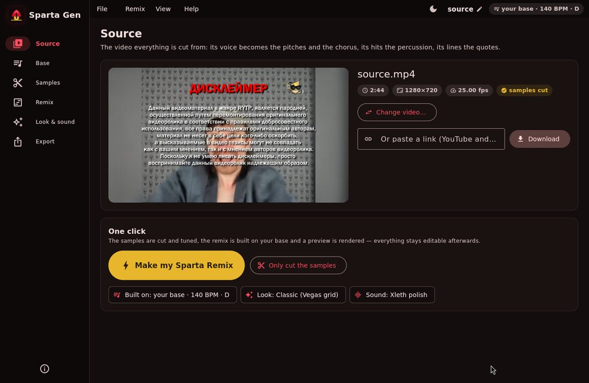
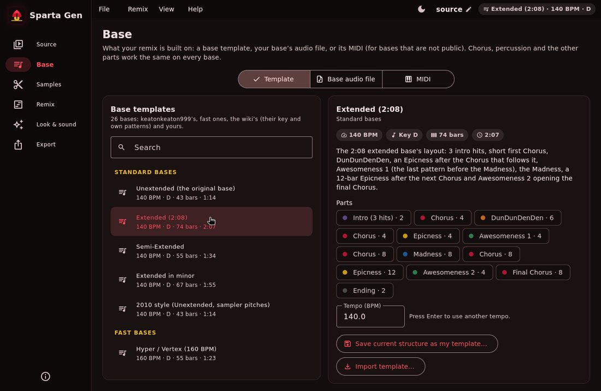
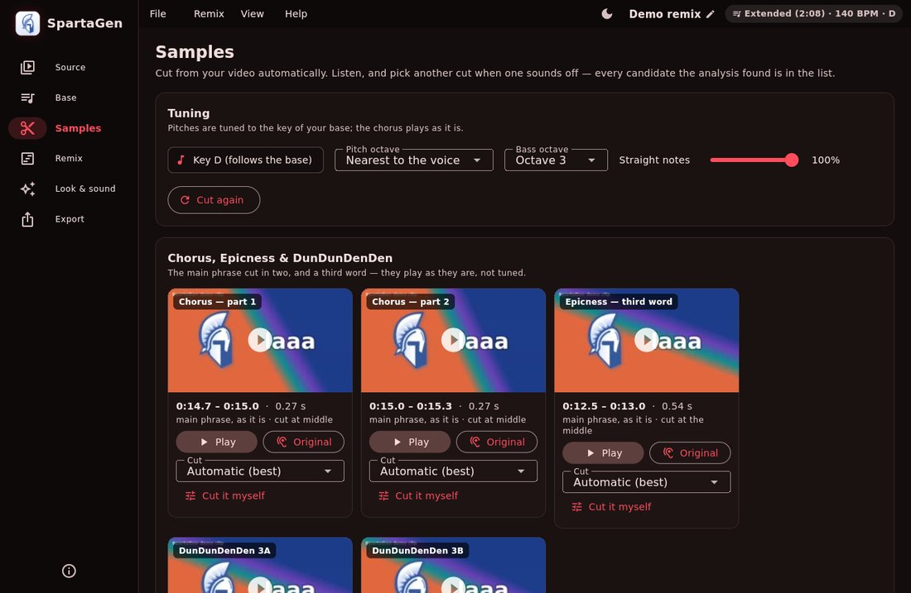
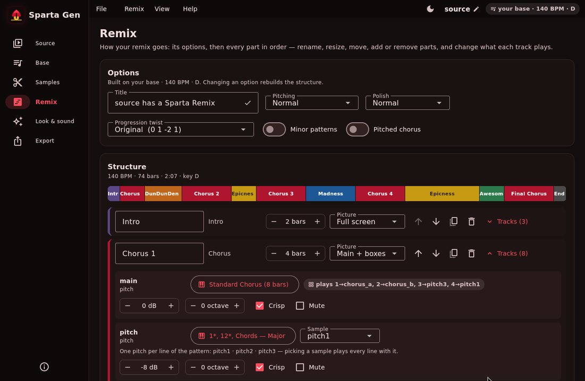
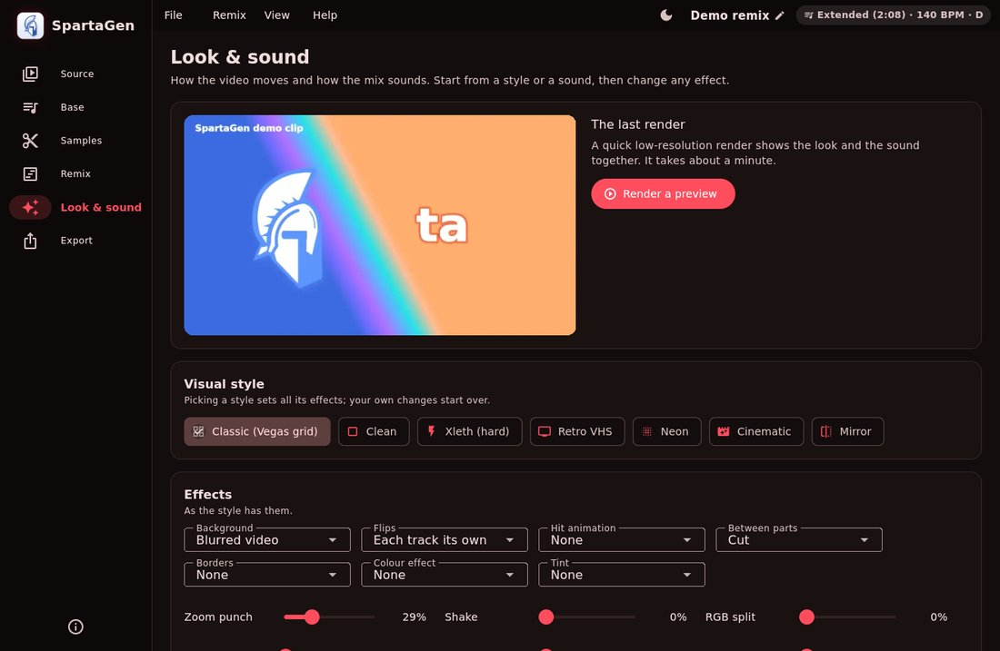
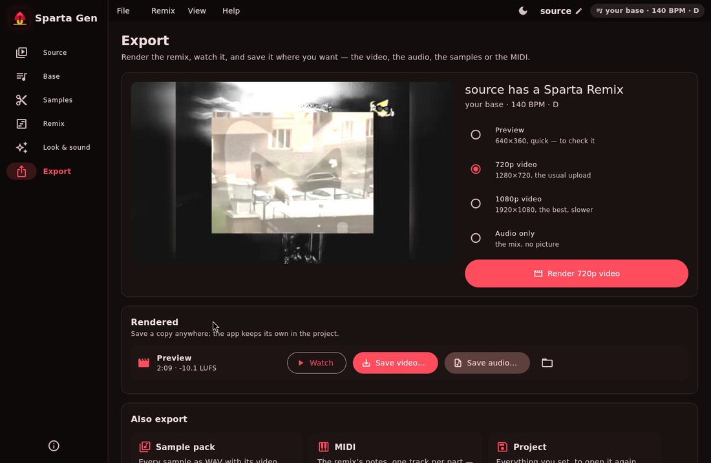
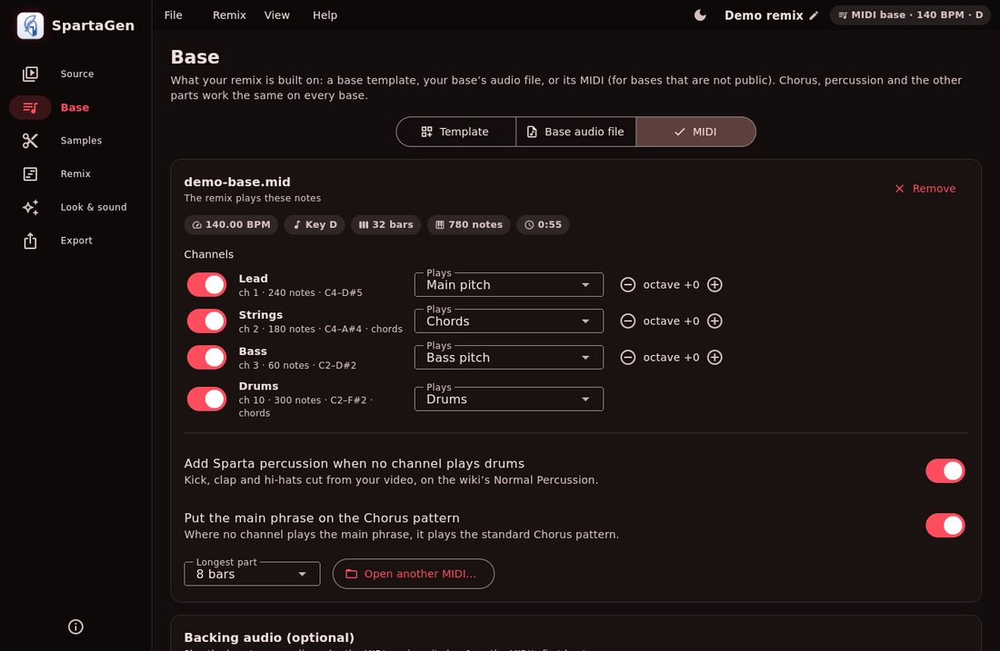
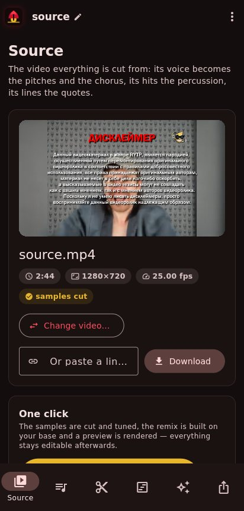
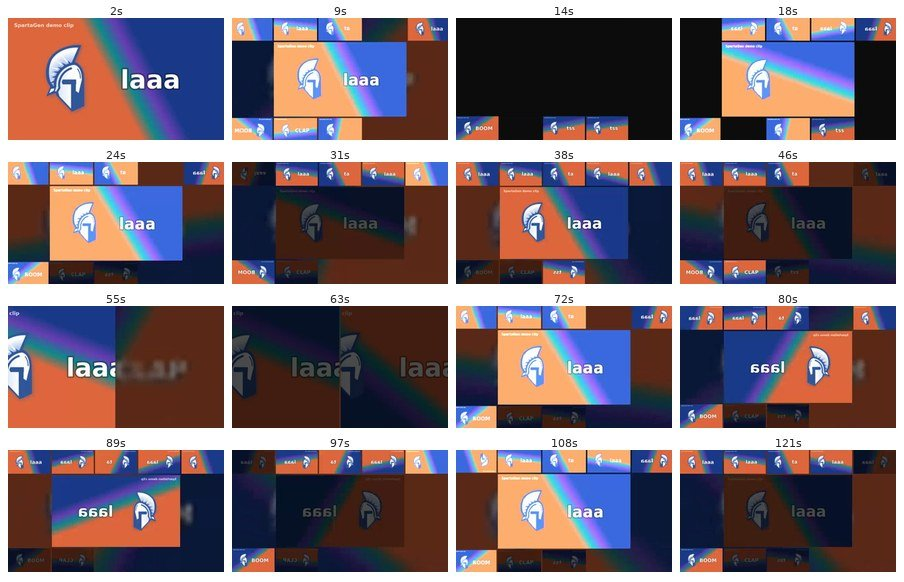

<p align="center">
  
</p>

<h1 align="center">SpartaGen — a real Sparta Remix generator</h1>

SpartaGen turns any video into a **Sparta Remix** the way remixers build them by hand — no AI music, no synthesizers:

1. **Cuts the source video into samples** with ffmpeg — held vowels/notes become *pitches*, thumps/bangs/hisses become
   *kick, snare/clap, hi-hats and crash*, and speech becomes *quotes*, *Madness words* and *DunDunDenDen syllables*.
2. **Fixes every pitch sample onto the base's key** (D on the classic bases) with TD-PSOLA hard-tuning — the
   "Melodyne pitch drift 100 %" treatment — **main**, **second**, **third** and **fourth** pitches, and the
   **bass pitch**: a held note of its own (another moment of the video, so its box shows its own clip) played down
   to D3 like a sampler.
   The **Chorus plays two layers**: the **main phrase** — cut into two parts at the gap between its syllables (on a
   zero crossing) and played as it is on the Chorus pattern, `1` the first part, `2` the second ("the chorus always
   contains the main phrase", Sparta Remix Wiki) — and **several pitches** under it, playing together: the wiki's
   *1\*, 12\*, Chords* lines — root, third and fifth, each line on its own pitch sample, bouncing root/octave in
   8ths on the chords (the fourth pitch doubles the roots an octave down in the Final Chorus). The main phrase **keeps playing through the Epicness
   and the Awesomeness** ("for the tricky epicness pattern, you will need 3 quote/word samples (the two of them you
   used is in your chorus)" — GageDaRemixer's guide on the wiki), with the chords held under it on the second to
   fourth pitch. The DunDunDenDen chops the main phrase.
   Pitch samples cut from songs are **isolated first** (only the held note's harmonics are kept, the band under it
   is pushed down ~30 dB) so they still sound like clean notes once tuned.
3. **Sequences the patterns from the Sparta Remix Wiki** (standard Chorus `11_11_111_1_1_11222_2_222_222_2_…`,
   DunDunDenDen, Madness call & response, the Epicness and its 13 edits, Awesomeness 1/2 and 30 custom ones,
   Execution, chords, percussion and hi-hat patterns, 43 freestyles…) over the classic D → E♭ → C → E♭ progression.
4. **Builds on your base** — one of the **base templates** (the Sparta Remix's own Extended base, whose audio comes
   with the app and plays under the remix, and four MIDI bases — Stroll, Nana-iro, Blend S and Decline CTE — whose
   notes the samples play, plus your own), **your base's
   audio file** (tempo, bar 1, key, chord progression and its sections —
   Intro, Chorus, DunDunDenDen, Awesomeness 1, Madness, Epicness, Awesomeness 2, Ending — read from it, and the
   remix built on it bar for bar), or **its MIDI** for bases that are not public (you say what each channel is,
   switch channels off, and Sparta percussion is added when there is none).
5. **Polishes the mix with an Xleth-style FX rack** (3-band OTT, ChorusCrisp "Jario" pluck, compressor, limiter,
   saturation, reverb, delay, chorus, flanger, phaser, transient shaper, sidechain pump, filter sweeps, tape stop).
6. **Renders the video**: every note shows its own clip, in sync — fullscreen hits, Madness split screen, 3×3/4×4
   grids, flips on every hit, flashes and kick zoom-punch — over the source itself, blurred and dimmed, behind the
   boxes. **Seven visual styles** (Classic, Clean, Xleth, Retro VHS, Neon, Cinematic, Mirror) and every effect in
   them adjustable; **six sound presets** with every FX amount adjustable.

Everything happens in **one app — SpartaGen — on Windows, macOS, Linux, Android and iOS**: a real app with the
system's own windows, menus, *Open* and *Save* dialogs and video players (no web page, nothing to install besides
it — the engine and ffmpeg are inside). **One click** does it all: open your video, pick your base, press
**⚡ Make my Sparta Remix** — the samples are cut automatically, the remix is built on the base and a preview is
rendered — then fine-tune anything you like, and **Save** it where you want.

> **Inspired by Krasen** ([CassidyBOTRR on YouTube](http://www.youtube.com/c/CassidyBOTRR),
> [composition-cassidy on GitHub](https://github.com/composition-cassidy)) — the first to make a program for remixers
> and others with AI: [Xleth](https://github.com/composition-cassidy/Xleth). SpartaGen follows that idea.

> **Release candidate (1.0.0 RC 3)** — everything is in; now it needs testing by everyone.
> See [Release candidate — please test](#release-candidate--please-test).

### Quick start — your next remix, on your own

1. Open **SpartaGen** (see [Install](#install)).
2. **Source**: open your video (*Open video…*, drop it on the window, paste a link — or on a phone *Share → SpartaGen*
   from the gallery).
3. **Base**: pick a **template** (Unextended, Extended 2:08, a fast or a wiki base…), open **your base's audio file**
   (mp3/wav — its tempo, key and parts are read), or its **MIDI** — optional: the Unextended template is the default.
4. Press **⚡ Make my Sparta Remix** — the pitches are tuned to the base's key, the percussion, chorus and quotes are
   cut, the remix is built and a preview plays on the *Export* page.
5. Not happy with a sample? **Samples** → listen, pick another cut. Another pattern or part? **Remix**. Another
   look or sound? **Look & sound**.
6. **Export** → render **720p/1080p** → **Save video…** (and **Save audio…** as WAV or MP3) where you want; the
   **sample pack**, the **MIDI** and the **project** too.

Command line, same thing: `spartagen make my_video.mp4 --base my_base.mp3 --pack my_pack/`.

---

## Contents

- [Quick start](#quick-start--your-next-remix-on-your-own) · [Install](#install) · [Updates](#updates) · [Using the app](#using-the-app) · [Android app](#android-app) · [iOS app](#ios-app) · [Desktop apps](#desktop-apps) · [Release candidate — please test](#release-candidate--please-test) · [Command line](#command-line)
- [Bases](#bases) · [Pattern notation](#pattern-notation) · [How samples are made](#how-samples-are-made)
- [Look & sound](#look--sound) · [Using a real Sparta base](#using-a-real-sparta-base) · [Sample pack export](#sample-pack-export)
- [Development](#development) · [Credits](#credits) · [Known limitations](#known-limitations)

## Install

| Platform | Download | Then |
|---|---|---|
| **Windows** 10/11 (64-bit) | `SpartaGen-Windows-x64.zip` | Unzip, run **SpartaGen.exe** in the `SpartaGen` folder. First start of an unsigned app: *More info → Run anyway*. |
| **macOS** 12+ with Apple silicon (M1 or newer) | `SpartaGen-macOS-arm64.zip` | Unzip, move **SpartaGen.app** to Applications. First start: right-click → *Open*, or *System Settings → Privacy & Security → Open Anyway* (or `xattr -dr com.apple.quarantine "/Applications/SpartaGen.app"`). Intel Macs are not supported (see [Known limitations](#known-limitations)). |
| **Linux** (x64, glibc 2.39+: Ubuntu 24.04+, Debian 13+, Fedora 40+ …) | `SpartaGen-Linux-x64.zip` | Install **libmpv** once (Ubuntu/Debian: `sudo apt install libmpv2`, Fedora: `sudo dnf install mpv-libs`, Arch: `sudo pacman -S mpv`), unzip, run `SpartaGen/spartagen` — `SpartaGen/add-to-menu.sh` puts it in your applications menu. |
| **Android** 7.0+ (64-bit ARM) | `SpartaGen-Android.apk` | Open it on the phone, allow installing from that source. It installs over earlier SpartaGen APKs. See [Android app](#android-app). |
| **iPhone / iPad** (iOS 15+) | `SpartaGen-iOS.ipa` | Not in the App Store: install it with [AltStore](https://altstore.io) / [SideStore](https://sidestore.io), [Sideloadly](https://sideloadly.io) or your own Apple developer account. See [iOS app](#ios-app). |
| **From source** (any desktop) | this repository | Python 3.9+, then double-click `scripts/run_windows.bat` / `scripts/run_macos.command`, or run `scripts/run_unix.sh`: the first start installs the engine (ffmpeg from `imageio-ffmpeg` if you have none); with [Flutter](https://docs.flutter.dev/get-started/install) installed it runs the app itself, without it the classic web app opens in your browser. |
| **pip** (engine and command line) | `pip install -e ".[all]"` | `spartagen make …` (see [Command line](#command-line)); `spartagen gui` serves the classic web app in a browser — e.g. on a phone in [Termux](https://termux.dev) (`scripts/install-termux.sh`). |

Every [release](https://github.com/ovlweb/sparta-gen/releases) has these files (its version is in the release's
name). Once installed, SpartaGen **updates itself** from there — see [Updates](#updates).

**Where the apps are**: GitHub → *Actions* has a workflow per app — **Desktop apps** (Windows, macOS, Linux),
**Android app** and **iOS app** — that builds and tests it; *Run workflow* there builds it any time, and the run's
*Artifacts* hold the apps (`SpartaGen-Windows-X64`, `SpartaGen-macOS-ARM64`, `SpartaGen-Linux-X64`,
`SpartaGen-Android`, `SpartaGen-iOS`). Push a tag like `v1.0.0-rc2` — or *Run workflow* on **Release** with that
version — and **Release** builds all of them, as that version, into **one GitHub release** (a pre-release for `rc`
tags; a version that is out already is refused). It is the same app everywhere: same engine, same screens, same
one-click remix.

Requirements (from source): **ffmpeg** and **numpy**. `scipy` (faster), `yt-dlp` (links), `pillow` (audio-only cards) are optional —
there is a pure-numpy fallback for every filter, so minimal installs (e.g. Termux without scipy) still work.

## Updates

SpartaGen looks for a new version when it starts — straight from this repository's
[releases](https://github.com/ovlweb/sparta-gen/releases), no need to come here for it — and says so at the top of the
window; *Help → Check for updates…* looks any time (and has the switch for looking at start). It reads the releases
through GitHub's API, and through the releases feed when the API is busy (it answers 60 times an hour per internet
address); a repository that moves is followed. Release candidates (`-rc`) are offered to release candidates only.
1.0.0 RC 1 came before the updater: install the next release over it by hand, once.

- **Windows, macOS, Linux**: **Update and restart** downloads the new app, puts it where this one is and starts it;
  your projects and settings stay. An app in a folder you cannot change (`C:\Program Files`, say) is updated by hand.
- **Android**: **Download and install** hands the new APK to Android's installer (once: allow SpartaGen to install
  apps). It installs over this one and keeps your projects — every release is signed with the same key.
- **iPhone, iPad**: iOS lets no app install apps itself, so an update goes through the app that installed it —
  SpartaGen offers the ones it finds:
  - **TrollStore** installs the new IPA over this one from its link (`apple-magnifier://install?url=…`; turn on
    *URL Scheme Enabled* in TrollStore's settings first). TrollStore marks the apps it installs (a `_TrollStore`
    file beside the app), so SpartaGen knows and offers it first.
  - **SideStore** and **AltStore** install it from its link too (`sidestore://install?url=…`,
    `altstore://install?url=…`), signing it again with your Apple ID.
  - **Installed with a certificate of your own** (Sideloadly, ESign, your developer account …): updates are by hand
    — *The IPA* downloads it; install it the way you installed this one.

## Using the app

On a computer the buttons show their icon (rest the pointer on one for its words); on a phone they show their
words too. The app has its own font, Inter, the same on every system.

Six pages, in the order you go — on a computer in a side bar, on a phone in the bottom bar. The menu bar
(*File*, *Remix*, *Help*; the app menu on macOS) has the rest, with shortcuts: **Ctrl/⌘+N** new project,
**Ctrl/⌘+O** open, **Ctrl/⌘+S** save, **Ctrl/⌘+Shift+S** save as, **Ctrl/⌘+Enter** make the remix,
**Ctrl/⌘+R** render a preview, **Ctrl/⌘+.** stop the sound, **Ctrl/⌘+1…6** the pages. Click the project's name to
rename it; the app opens the project you worked on last. Every change is kept at once (a dot by the project's name
until it is saved); leaving a project with changes (a new one, another opened, the app closed) asks: **Save**, **Don't
save** (back to how you saved it last — a project never saved is deleted) or *Cancel*. *File → Recent projects* lists
your projects, each with a button to delete it (its folder goes too: renders, cut samples).

1. **Source** — *Open video…* (the system's Open dialog), drop a file on the window, or paste a YouTube/other link
   (downloaded with yt-dlp). The video plays right there. **⚡ Make my Sparta Remix** does everything in one go;
   *Only cut the samples* stops after the samples. **More videos**: add others to cut samples from — on the Samples
   page each sample can come from any of them (the pitches from one, the kick or a hi-hat from another).
2. **Base** — what the remix is built on:
   - **Template**: the *Bases* — the **Sparta Remix (Extended base)** (2:08 at 140 BPM in D: the base most remixes
     are made on — its audio comes with the app and plays under the remix, which follows it as it is read from the
     audio, bar for bar, with the wiki's patterns on its parts) and four **MIDI bases** that come with the app: **Sparta
     Stroll Base** (0:49, 127 BPM, C# minor), **Sparta Nana-iro Base** (2:44, 130 BPM, F# minor), **Sparta Blend S
     Base** (by enforch sr — 2:05, 140 BPM, E) and **Sparta Decline CTE Base** (by Citrus — 2:09, 140 BPM, C minor).
     A MIDI base's template plays its notes on your samples: which instrument the main pitch, the other pitches,
     the chords and the bass play (its lead, arps, chords and bass line — doubled and padding parts left out), its
     parts bar for bar (Intro, Chorus, DunDunDenDen, Epicness, Awesomeness, Madness, Ending — Blend S and Decline
     CTE are laid out the Extended way, with an Awesomeness before the first Epicness) and its key are set for each
     base;
     change any channel under *MIDI*. And *My templates* — search, see each one's parts; **save the current structure
     as your own template** (on a MIDI: with the MIDI and what each channel plays; with your base audio under it),
     **Export as zip…** any template — its MIDI, its audio and its settings in one file to share — and **Import
     template…** (a `.zip`, or a `.spartabase.json`), or delete them. (The wiki's pitch patterns are all still there
     to pick for any track.) **Your own base audio plays under any template** (*Add base audio…*): the template's
     notes — its parts, its bass line, its drums — stay what the remix plays, and the file plays under them, its
     bar 1 on the template's first bar (move it a beat or a 16th if it is off).
   - **Base audio file**: open your base; its tempo, bar 1, key, chords and parts are read and the remix follows
     them. Or tell it which template the base is: a MIDI base's template then plays its own MIDI — its parts, bass
     line and drums, not a reading of the audio — with your file under it (the file only says where its bar 1 is);
     the Extended base is followed as the template knows it (its parts, chords and tempo). Base volume, whether
     our drums and bass play over it, and its timing (a beat or a 16th earlier or later).
   - **MIDI**: open the MIDI of any base — even one that is not public. Each channel is listed with its notes and
     range: say what it plays (the main phrase, a pitch, the chords, the bass, drums, kick/snare/clap/hat/crash,
     quotes, Madness words) or switch it **off**, move it an octave, set its volume (a channel that doubles another
     starts off; two that never play together can share a pitch; the bass is the channel that plays the bass line
     — low, or on the chords' roots — not one just named "bass" that plays up with the pitches);
     add **Sparta percussion when no channel has drums**, and the main phrase where no channel plays it. The
     base's parts are read from what its channels play — the Chorus is the full texture that keeps coming back,
     the Intro what comes before it, the dips the DunDunDenDen and the Madness — so the main phrase comes in where
     the base's Chorus does (not from 0:00), with each part's own pattern. The base's audio can play under it.
   - **Key**: *Auto* follows the base (template, audio or MIDI); or pick one of the 12 keys.

   A base you opened plays under whatever the remix is built on — that base, your MIDI or any template. The base a
   template comes with (the Extended's) plays only under that template, never under another one's notes.
3. **Samples** — every sample with its picture, where it was cut and its note (e.g. `D#5 → D5 (-1.01 st)`):
   ▶ plays it processed, *Original* plays that stretch of the video — press again to stop it (or **Stop** in the bar
   at the top, which shows whatever plays, on any page). With several videos, **From** says which one a sample is
   cut from: its list of cuts and the cutter are that video's. Pick another cut from the list the analysis
   found, or **cut it yourself**: the video's sound as a waveform and its frames as a film strip, the cut between
   two handles you drag — it opens on where the sample is cut now; play the cut, zoom (the mouse wheel zooms around
   the pointer, two fingers pinch), drag outside the cut to look around (the waveform and the frames follow at
   once), or type the times. The bass
   is picked and cut the same way (a note of its own, played low). Pitch octave, bass octave and how straight the
   notes are tuned; **Pitches: deep ↔ high** plays every pitch an octave or two lower or higher (the key stays, the
   samples are not cut again) — for bases whose parts sit high; *Cut again* to redo it all.
4. **Remix** — title, pitching (classic sampler / normal / hard layers), polish, *Progression Twist* (Original
   `0 1 -2 1`, E Note, F Note, Useful's …), minor patterns, pitched chorus. The **structure** below is a timeline of
   the parts, each as long as it lasts: **drag a part** to move it, **drag its edge** to make it longer or shorter,
   tap one to rename it, pick its picture (the layouts drawn as they look), duplicate or remove it; **add** parts
   (Intro, Chorus, DunDunDenDen, Epicness, Chords, Awesomeness, Madness, Execution, Final Chorus, Ending) with a
   tap. Open a part's tracks to change each one: its pattern (a searchable list of every wiki pattern, or your own
   in wiki notation), sample, volume, octave, crisp, mute. **Edit as blocks** shows a track's pattern as blocks on
   a grid of 16ths instead of notation — a row per note (pitches: the notes of the key, the root lit; drums, the
   chorus and words: what each slot plays), tap a square to put a block there, tap a block to take it away, drag
   with the mouse for a longer one; blocks that sound together make a chord; bars, the length of a new block, 32nds,
   zoom and undo; ▶ plays the pattern on its samples. *Done* writes it back as the wiki's notation (shown under the
   grid), so it plays exactly as drawn — an Epicness lead-in, a pattern's own loop and a free melody stay as they
   were. The pictures: *Main + boxes*, *Full screen*, *Split in two*, *3×3*, *4×4*, and **Pitches & percussion** — no
   chorus (it is heard, not seen): the part's pitch lines and bass in a row across the top, its drums in a smaller
   row along the bottom, a line between them, so no hi-hat is taken for a pitch.
   *Save structure* keeps your edits.
5. **Look & sound** — see [Look & sound](#look--sound): pick a visual style and a sound, change any effect, set each
   part's **volume** — and see it at once: the **live preview** draws the remix at any moment with every change
   (scrub it, jump to a part, step a beat), no render needed. What you choose there stays for your next projects.
6. **Export** — render a **preview** (quick), **720p**, **1080p** or **audio only**; watch it; **Save video…** and
   **Save audio…** (WAV or MP3) open the system's *Save* dialog. Also the **sample pack** (ZIP, or into a folder),
   the remix's **MIDI** (to finish it in a DAW) and the **project** (*Save* / *Save as…*).

<p align="center">
  
  
  
  
  
  
</p>
<p align="center">
  </p>

## Android app

The APK is the whole thing on the phone — no Termux, no computer: the same app as on the desktop (Flutter), the same
engine (Python, run by [Chaquopy](https://chaquo.com/chaquopy/)) and ffmpeg built for Android inside.

- **Install**: download `SpartaGen-Android.apk` (see [Install](#install)), open it, allow installing apps
  from your browser/file manager when Android asks. Needs Android 7.0+ on a 64-bit ARM phone (nearly every phone
  since 2017). It installs over the earlier SpartaGen APKs (same app id, same signing key).
- **Use**: *Choose a video* opens the phone's picker (gallery, files, Drive…); or **Share → SpartaGen** from the
  gallery. **Save video…** / **Save audio…** open Android's *Save* screen: you choose the folder and the name.
- The engine runs as a foreground service ("SpartaGen engine" notification) so a render goes on with the screen off
  or another app in front; *Back* on the first page leaves the app running. The engine only answers the app (a
  secret token per start). Projects live in the app's own storage (`Android/data/gen.sparta.remix/files/SpartaGen`).
- A phone is slower than a computer: a 2-minute remix's preview takes a few minutes, the 720p render longer.

How it is built (`app/android/`; the *Android app* workflow, `android.yml`: *ffmpeg*, *APK*, *Emulator test*): `app/android/ffmpeg/build.sh` cross-compiles x264 + ffmpeg with the Android NDK and packages the
program as `libffmpeg.so` (Android only lets an app run programs from its native-library folder); Flutter, Gradle and
Chaquopy package the app with the repository's `spartagen` package, Python 3.12, numpy and yt-dlp. An x86_64 build
runs on an Android emulator: the engine starts (and refuses calls without its token), its ffmpeg runs and the
one-click remix renders a preview — still going after the app is sent to the background halfway; the arm64 ffmpeg is
checked to run on phones. See [app/android/README.md](app/android/README.md).

## iOS app

The same app on an iPhone or iPad, with everything inside it: iOS lets no app start another program, so the engine
runs in the app itself — Python for iOS (CPython's own iOS build, from
[BeeWare's Python-Apple-support](https://github.com/beeware/Python-Apple-support)) with numpy, and ffmpeg as a
library ([FFmpegKit](https://github.com/sk3llo/ffmpeg_kit_flutter), the full-gpl build) that the engine calls instead of
starting ffmpeg.

- **Install**: `SpartaGen-iOS.ipa` is not signed — Apple only lets an iPhone run apps signed for it. Install it
  with [AltStore](https://altstore.io) or [SideStore](https://sidestore.io) (with a free Apple ID the app has to be
  refreshed every 7 days — they can do that for you), [Sideloadly](https://sideloadly.io) from a computer, or sign it
  with your own Apple developer account (a year, or TestFlight). iOS 15 or later.
- **Use**: *Open video…* → **From Photos** or **From Files**; **Save video…** / **Save audio…** open the share sheet
  (*Save Video* to Photos, *Save to Files*, AirDrop …).
- **Keep SpartaGen in front while it renders**: the screen stays on while it works, but iOS pauses an app that is
  sent to the background — the render goes on when you come back to it.
- The app is big — a 60 MB download, about 180 MB on the phone: ffmpeg is in it twice (the video player's and
  the engine's), with Python and numpy.

How it is built (`app/ios/`; the *iOS app* workflow, `ios.yml`): `app/ios/Engine/prepare.sh` fetches Python for iOS,
FFmpegKit (made into device + simulator xcframeworks) and numpy, yt-dlp and certifi built for iOS; the app's Xcode
build phase `app/ios/Engine/install.sh` puts Python's standard library, the repository's `spartagen` package and those
packages into the app and turns every compiled Python module into a signed framework (as CPython's iOS testbed does);
`Runner/SpartaGenEngine.m` starts Python and hands the engine ffmpeg as a function (`spartagen/ios.py`,
`spartagen/ffmpeg_function.py` — tested on Linux too, with a stand-in C function). A debug build runs on the iOS
simulator: the engine starts (and refuses calls without its token), the app connects to it, and the one-click remix
renders a preview.

## Desktop apps

The desktop app is the Flutter app (`app/`) with the engine inside: `scripts/build_desktop.py` freezes the engine
with PyInstaller — Python, numpy/scipy, yt-dlp and a static ffmpeg — as `spartagen-engine`, builds the app
(`flutter build windows|macos|linux`) and puts the engine in it (`SpartaGen/engine/`, or
`SpartaGen.app/Contents/Resources/engine/`). The app starts it in the background on a free local port with a
secret token, and it quits with the app. Zipped as `SpartaGen-<version>-<os>-<arch>.zip` (a release names them
`SpartaGen-<os>-<arch>.zip`).

CI builds it on Windows, macOS (Apple silicon) and Linux and tests every one before keeping it: the
engine's **self-test** (`spartagen-engine --selftest report.json`: a test video through the one-click remix, then
saved as MP4 and MP3 the way the app saves, with the bundled ffmpeg — `spartagen selftest` does the same from a source
install), the engine **started the way the app starts it** (it must answer with its token and refuse without it),
then the packaged **app must start its bundled engine** (`SPARTAGEN_SMOKE_REPORT=report.json`). If the engine
crashes, the log shows where each of its threads was and, on macOS, the system's crash report.

## Release candidate — please test

This is **1.0.0 RC 3**: every feature is in, and it needs people to try it on their own videos, bases and
computers. Things worth trying:

- [ ] The one-click remix on a few different videos (speech, songs, loud and quiet ones).
- [ ] A template from each group (standard, fast, wiki); your own base's audio file; a MIDI base (with a channel off,
      and with the percussion added).
- [ ] Changing the key; a base that is not in D.
- [ ] Swapping samples and cutting one yourself; the structure editor (add, move, remove parts; change patterns).
- [ ] Every visual style and sound preset, and a few effects changed by hand.
- [ ] Rendering 720p/1080p and saving the video and the audio (WAV and MP3) where you want; the sample pack, the MIDI.
- [ ] Closing and opening the app again (your project comes back); *File → Recent projects*, deleting one.
- [ ] Leaving a project with changes: *Save*, *Don't save* (it goes back to how it was saved), *Cancel*.
- [ ] Samples from two videos: *More videos* on the Source page, *From* on the Samples page.
- [ ] Your own base audio under a MIDI template; a template exported as a zip and imported again (MIDI, audio and
      channels with it).
- [ ] Stopping a sound: its own button again, or *Stop* in the bar at the top.
- [ ] On Android: *Share → SpartaGen* from the gallery, a render with the screen off, *Save video…*.
- [ ] On an iPhone or iPad: a video *From Photos*, the one-click remix, *Save video…* → *Save Video*.

When something goes wrong, open an issue with what you did, what happened, your system (Windows/macOS/Linux/Android
version), and — if the app could not start its engine — the text from *Copy the details* on that screen (the
Windows engine also writes `SpartaGen/engine.log` in your home folder).

## Command line

```bash
spartagen make  video.mp4 --base my_sparta_base.mp3 --pack pack/   # one command: samples, remix on the base, pack
spartagen make  video.mp4 --variant semi_extended --quality 720p -o remix.mp4
spartagen make  "https://www.youtube.com/watch?v=…" --variant extended --pack pack/   # also export the sample pack
spartagen make  video.mp4 --audio-only -o remix.wav --polish hard --progression "0 1 3 1 | -2"
spartagen make  video.mp4 --base my_sparta_base.mp3     # map the base and build the remix on its sections
spartagen base  my_sparta_base.mp3                      # just show the base map (tempo, bar 1, chords, sections)
spartagen analyze video.mp4              # what would be cut into samples (pitches with their notes, hits, quotes)
spartagen pack    video.mp4 -o pack/     # tuned samples as WAV + their video clips as MP4
spartagen patterns --section chorus      # the pattern library
spartagen patterns --parse "11_11_111_1_1_11222_2_222_222_2_"
spartagen variants
```

Useful options: `--bpm`, `--key D`, `--pitch-octave 4`, `--pitching classic|normal|hard`,
`--polish light|normal|hard`, `--minor`, `--chorus-pattern chorus.0_12`, `--chorus-pitch`, `--intro-pattern intro.nos`,
`--stems`, `--project project.json`.

## Bases

The bases that come with SpartaGen (each template carries its tempo and key; the MIDI bases their notes, which of
their instruments the samples play and their parts bar for bar):

| Template | BPM | Key | Length | Structure |
|---|---|---|---|---|
| **Sparta Remix (Extended base)** (its audio comes with the app) | 140 | D | 74 bars ≈ 2:08 | 3 intro hits · Chorus 4 · DunDunDenDen 6 · Chorus 8 · Epicness 4 (0:34) · Chorus 8 · Madness 8 · Chorus 8 · Epicness 12 · Awesomeness 2 · final Chorus 8 · Ending |
| **Sparta Stroll Base** (MIDI) | 127 | C# minor | 26 bars ≈ 0:49 | Intro 1 · Chorus 8 · Chorus 8 · DunDunDenDen 4 · Chorus 4 · Ending |
| **Sparta Nana-iro Base** (MIDI) | 130 | F# minor | 89 bars ≈ 2:44 | Intro 4 · Chorus 8 · DunDunDenDen 4 · Chorus 12 · Madness 4 · Chorus 8 · Epicness 8 (the gated chords) · Chorus 8 · DunDunDenDen 4 · Chorus 8 · Epicness 8 · Chorus 12 · Ending |
| **Sparta Blend S Base** (MIDI, enforch sr) | 140 | E | 73 bars ≈ 2:05 | The Extended way after a one-bar pickup, an Awesomeness before the first Epicness: Chorus 4 · DunDunDenDen 6 · Chorus 4 · Awesomeness 1 · Epicness 4 · Chorus 8 · Madness 8 · Chorus 8 · Epicness 12 · Awesomeness 2 · final Chorus 8 · Ending 2 |
| **Sparta Decline CTE Base** (MIDI, Citrus) | 140 | C minor | 75 bars ≈ 2:09 | The Extended way, an Awesomeness before the first Epicness: 3 intro hits · Chorus 4 · DunDunDenDen 6 · Chorus 4 · Awesomeness 1 · Epicness 4 · Chorus 8 · Madness 8 (the Rhodes lead) · Chorus 8 · Epicness 12 · Awesomeness 2 · final Chorus 8 · Ending 3 |
| **Your base's audio** | the base's | the base's | the base's | Every section of the base gets its part (see [Using a real Sparta base](#using-a-real-sparta-base)) |
| **Your base's MIDI** | the MIDI's | the MIDI's | the MIDI's | The MIDI's notes play on your samples, a role per channel |

On a MIDI base each part's notes are played around its sample's own note (the octave that keeps them nearest it; a
note more than 15 semitones away is played an octave nearer), and the bass keeps its register.

The pitch samples are tuned to the base's key (the template's, the one read from your base, or the MIDI's) unless you
pick one; chorus structure and percussion are the same on every base — only tempo, key and patterns differ.
`spartagen templates` lists them all; `spartagen make video.mp4 --template nanairo`, `--midi base.mid --midi-map …`
and `--key E` do the same from the command line.

Sections and what plays in them:

- **Chorus** — the main phrase on the standard 8-bar Chorus pattern (3 lines: main line ×2, swapped line, 32nd-note
  ending; `1` = first part, `2` = second part, as they are — tick *pitched chorus* / `--chorus-pitch` to tune it to
  the chords too) over several pitches playing the *1\*, 12\*, Chords* lines together: the main pitch on the
  roots, the second pitch on the thirds, the third pitch on the fifths (`0* 12*`, `4* 16*`, `7* 19*` …, the minor
  lines on a minor base); in the Final Chorus and with hard pitching the fourth pitch doubles the roots an octave
  down (the pattern's seventh line — a major seventh and a raised eleventh — clashes with a base's major chords, so
  it is left out; pick any other pitch pattern with the pattern list); ChorusCrisp pluck; the bass pitch on the
  offbeats; the *Sparta Percussion*: the kick line `1_332_331_332_33` (kick on 1 and 3, the snare with the kick
  paralleled — once — on 2 and 4, open hats between: "open hi-hats are mostly used for in-pattern hi-hats … the
  closed one mostly used a repetitive pattern"), hi-hat 1 on every 8th (`3_3_3_3_…`), hi-hat 2 on every 16th
  (`3333…`), the snare line on dotted 8ths (`1__2__1__2__1__2__1__2__`: snare and a second hit taking turns for a
  bar and a half) and an extra hit on the "and"s of beats 3 and 4 (as Citrus adds in his remix on the extended
  base); a crash whose clip flashes fullscreen for an 8th on the downbeat. The main phrase big in the middle, a box
  per pitch line (and the bass) along the top — a chord is one line: its root, third and fifth all sound, and it is
  seen once, in one box, so no line covers another — drums along the bottom. On a base there are no fills of our
  own: the base has its fills, so the pattern plays plain through every section. (A Chorus in the base's
  DunDunDenDen part instead, as one example remix does: `dundundenden_part="chorus"`.)
- **DunDunDenDen** (the Buildup) — the wiki's Original Pattern `1___2___3A___3B___`: loud quarter notes with
  silence in between, stepping through the **main phrase** as it is — `1`, `2` its parts, `3A`/`3B` the third word's
  halves — with a pitch sample on every hit on the chord root (`0 0 1 1 -2 -2 1 1`, one pitch per step). It builds
  like the base under it: the percussion joins a third of the way in, the held chords and the bass pitch two thirds
  in (on the 2:08 extended base: 0:10, 0:13, 0:17). The Chorus's frame, black between hits.
- **Madness** — the call & response (the Madness article's *Original Pattern*: `1` = first person's word, `2` = the
  second person answering, both together in the last bar) over the softer, low-passed Madness pitch patterns: the
  *First Pattern* from the first half to the end, the *Trance Gate* pattern joining from the second half.
  Split screen: the call on the left, the response on the right (one word found in the source: it answers itself
  on the right; none: the main phrase's two halves call and answer). Given a grid instead, the Madness shows its
  pitches, bass and drums too, each in its box.
- **Epicness** — after the Chorus that follows the DunDunDenDen and after the Chorus that follows the Madness.
  The Epicness pattern played by the Chorus's samples — `1` and `2` the main phrase's two parts, `3` a third word
  of the same voice — so the chorus never drops out; the pitches double the pattern on the chords and the second
  to fourth pitch hold the chords under it. By default it is the tutorial's version, on the downbeat, in every
  4-bar block: `1_1_332_1_1_11__1_1_113_3_22221_3_1_332_1_1_111_1111111111111111` with the second line's 3s
  (`3_3__________3__3_3333_33`) before and over the closing roll. The wiki's ORIGINAL (its `1*` as a lead-in two
  16ths before the section) and all 14 edits (CatmanTeam, TheInfySpartan, majugarzett…) are in the library, and an
  edit can alternate with it. The Chorus's frame (the main phrase big in the middle, a box per line along the top);
  no text over it (the spinning *OMG TEH EPICNESS* is an option: `"titles": true` in the project's video settings).
- **Chords (Pre-Awesomeness)** — held chords and `0*, 12*` bounces (a section you can add before an Awesomeness).
- **Awesomeness 1 / 2** — the pattern on the main pitch, an octave below on the second, the chords on the second
  to fourth pitch, and the main phrase following its rhythm (part 1 in the first half of each bar, part 2 in the
  second), in the Chorus's frame.
- **Ending** — one hit on the base's last chord (every pitch on its chord tone, bass, kick, clap, crash — once),
  then a quote from the source played as it is, fullscreen, while the chord rings out (a tape stop without a
  base). **Execution**, **Intro** (quotes, then the 3-hit intro pattern).

## Pattern notation

Patterns use the Sparta Remix Wiki notation (*Pitch Patterns* page):

| Symbol | Meaning | Symbol | Meaning |
|---|---|---|---|
| `***` | 4th note | `0` (bare number) | 16th note |
| `**` | "6th" note (3 sixteenths) | `'` | 32nd note |
| `*` | 8th note | `"` | 64th note |
| `+#` / `-#` | # semitones up / down | `_` | 16th rest |
| `#` | root key/note (`0`) | `/` · `\` | 32nd · 64th rest |
| `\|` | semi-progression (split) | `*****` · `******` | dotted quarter · half note |

Three styles are recognised automatically (you can also force one):

- **semitone** — `0* 12* 0* 12* 1* 13* …`: numbers are semitones from the base's root (0 = D).
- **compact** — `00_00_0011_11_11-2-2_…` (Madness *First Pattern*): each digit is its own note.
- **index** — `11_11_111_1_1_11222_2_…` (standard Chorus, Madness): digits are **slots** — 1 = main pitch / first
  speaker, 2 = second pitch / second speaker… — and each hit plays the root of the current chord.

Picking a **Progression Twist** re-targets every semitone pattern written for `0 1 -2 1` (e.g. under `0 1 2 1` a
note on C moves to E). Multi-line patterns (Chords) play their lines together — in the remix templates each line on
its own pitch sample (root on the main pitch, third on the second, fifth on the third, seventh on the fourth), so
several pitches are heard at once; the chord is seen once, in its line's box.

Index patterns may use `B` (slots 1 and 2 together, from the Madness freestyles); `=` holds the note before it a
16th longer (the block editor writes lengths no mark has that way: `-5*****=` is 7 sixteenths).
Percussion patterns are index patterns too: `1` kick, `2` clap/snare (with the kick paralleled, as the Percussion
article describes), `3` hi-hat.

The library holds **214 patterns** from the wiki (7 progressions, 6 intros, 27 chorus patterns, 13 chord sets,
16 DunDunDenDens, 15 Execution patterns, 34 Awesomeness (originals + customs), 9 Madness pitch patterns and 6 call &
response patterns, 15 Epicness patterns, 18 percussion and 5 hi-hat patterns, 43 freestyles).
Where a wiki transcription did not add up to whole bars, the obvious typo is fixed and documented in the source
(`spartagen/patterns/library.py`, field `fix`).

## How samples are made

- **Detection** (`spartagen/audio/analysis.py`): frame features at ~11.6 ms (energy, band energies, band-limited
  spectral flatness, spectral flux, MFCCs) plus a vectorised YIN pitch tracker.
  - *Pitch* candidates are steady voiced windows (local pitch spread < 35 cents), ranked by length, stability,
    clarity, loudness and "vowel-ness". Pitch 2 and 3 come from other moments of the source (another word or
    speaker) so the Chorus call & response is audible.
  - *Kick* = sharp onsets with low-frequency body; *snare/clap* = sharp, noisy, broadband "bangs";
    *hats* = sibilants ("s", "ts") and cymbal hiss; *crash* = longer loud noisy stretches.
  - *Quotes* are phrases between pauses; *words* are split at energy valleys; the best quote is the
    **main phrase**, chopped into syllables for the DunDunDenDen.
  - The **main phrase** (the Chorus clip) is the best clear word or short phrase of the voice — held notes beat
    glides, which keeps a sliding instrument from winning over the singer — cut in two at the deepest energy valley
    between 35 % and 65 % of it (else at the biggest change of sound, else the middle), snapped to a zero crossing.
    The parts keep their own sound; a tuned copy is only used with *pitched chorus*. The Epicness's third sample is
    the next best word of the voice, whole, from another moment of the source. The DunDunDenDen syllables and
    the ending use the same phrase; the Madness words come from the same voice ranking.
- **Isolation** (`spartagen/audio/harmonic.py`): a held note cut from a song carries the band under it. A
  time-varying harmonic mask on the short-time spectrum keeps the bins around every harmonic of the tracked note
  (the detected pitch stands in where the band hides it from the tracker) and pushes everything between them
  ~30 dB down — the source's own audio, filtered, like Melodyne's note separation. Pitch candidates are ranked by
  how clearly they read as a note once isolated and tuned — voiced, harmonic, and sitting on the note (a singer
  bending into a note from its neighbour keeps some of the bend through the tuning), and keeping its level an
  octave up (a voice with hardly any overtones loses its high notes) — and longer held notes win.
- **Whole held notes**: pitch candidates come from the full mix, where the band hides the voice now and then; each is
  grown to the whole note on the isolated voice (same note within 60 cents, up to 0.9 s), so it needs less
  stretching to fill an 8th or a held chord.
- **A pitch is the held note**, not the sung word: each pitch is cut to its steady core (voiced, loud, on one
  pitch), dropping the consonant before it and the glide after it — the clip with it.
- **Pitches that sound different**: after the main pitch, each pitch is picked for quality *and* for how far its
  sound (mean MFCCs once tuned — vowel, voice, instrument) is from the pitches already chosen, so the several
  pitches are not the same note four times. They all share the main pitch's octave (they play chord lines
  together), and a note that still loses its level when shifted far up is played the sampler way.
- **One shot per pitch** (music videos): a note the video cuts away from is shortened at the camera cut (colour
  histogram / picture jump), audio with the picture, so each pitch's box shows one shot; an automatic pick has to
  keep at least 0.18 s of its note inside one shot (an 8th at 140 BPM is 0.21 s), else it is passed over.
- **Automatic picks, no help needed**: every pitch candidate is grown, isolated, tuned and measured; a pick is
  rated by how the note comes out (its steady core's length, not the clip around it), how clearly it reads as a
  note, and how little it has to move to reach the key; the pitches come from other clips than the Chorus's (heard
  and seen in every Chorus already) and from other moments than each other; and the second to fourth pitch are
  dealt out by how well they take an octave up — the Chorus lifts the third pitch highest (+19), the second next
  (+16), the fourth plays the low root. On the source of the example remix, the automatic picks are three of the
  four pitches chosen by ear, and every note of the remix sits within ±35 cents of its target. Tuned candidates are
  kept per source, so swapping a pick on the *Samples* page rebuilds in a moment.
- **Tuning to D** (`spartagen/audio/psola.py`): pitch marks every period, TD-PSOLA re-synthesis with every period at
  the target note (formants kept). Transpositions reuse the synthesis marks; long notes are sustained by PSOLA
  stretching or ping-pong looping of the steady part.
- **Designed hits** (`spartagen/samples.py`): kick = the source's thump, at most an octave down so it keeps its
  knock (body ~90–150 Hz), + pitch-sweep punch + the original click; snare/clap = EQ'd bang with transient boost
  (clap = three retriggers); hats = high-passed hiss with short/long decays; crash = noise + long reverb tail;
  bass = a held note of its own — of the good ones clear of the pitches' and the Chorus's moments, the lowest —
  tuned, then played down to D3 like a sampler, lightly filtered and saturated.

Every sample keeps its source time range, so its **video clip is known** — that is what the renderer shows, as fast
as the note plays it: a note shifted the way a sampler does (classic pitching, the bass, a kick pitched down) runs
its clip faster up and slower down, as a clip's playback rate does in Vegas. **Each box is one sound's**: no sample
borrows another's clip (the bass is not the main pitch's clip again), and a drum's box never shows a pitch.

## Look & sound

The **live preview** draws the remix's picture at any moment (the engine draws that one frame, with the current
look), so an effect shows the moment it is changed; scrub the timeline, jump to a part, step a beat or a 16th.
A **chord** — its root, third and fifth, each on its own pitch — is one picture in one box: the voices are
**three layers in one**, from normal to small (the root the whole box, the third over it smaller, the fifth
smaller again), each showing its own voice's clip, with no colours of their own. They sit where the box sits:
centred in a box in the middle of the frame, against the left side in a box on the left and the right side on the
right (the top in the top row, the bottom in the bottom row).
**Volumes**: a fader for the main phrase, the pitches, the chords, the bass, the percussion and the quotes (and your
base file — the same fader as on the *Base* page), from −24 to +12 dB; a part switched off is out of the video too.
A volume (a fader here, a MIDI channel's) changes levels only: a structure you edited stays as it is. The look, the
sound and the volumes stay as you set them for your next projects.

**Visual styles** (each one a set of the effects below; pick one, then change any effect):
**Classic** (the Vegas grid), **Clean** (no flips or flashes, thin borders, black background), **Xleth** (rotating
flips, pop on hits, glow borders, shake, RGB split, invert on crashes, flash between parts), **Retro VHS** (scanlines,
grain, warm tint, vignette), **Neon** (glow borders, a new hue on every hit, dark background), **Cinematic**
(letterbox, vignette, fades) and **Mirror** (mirrored background and flips, zoom between parts).
The **background**: your video blurred (softly — it moves with the picture, no blocks, and loops without a gap at the
video's end), black, dark, mirrored, a gradient, or **your own video, GIF or picture** (blurred or as it is; a video
or a GIF loops), with its brightness.
The effects: flips (each track its own, none, alternate,
rotate, mirror), hit animation (pop, slide in), between parts (cut, flash, fade, zoom), borders (line, glow — in each
part's colour or one of yours), colour effect (hue on every hit, invert on crashes, mono), tint (warm, cold, sepia,
vivid), zoom punch, shake, RGB split, scanlines, grain, vignette, letterbox, flashes, keeping the last clip dimmed.

**Sound presets** (the FX over the whole mix): **Xleth polish**, **Clean**, **Loud & crisp**, **Lo-fi**,
**Big room**, **Retro 2010** — then reverb, delay, OTT, sidechain pump, drive, stereo width and lo-fi each from 0 to
more than the preset has, and tape stop at the end, risers into the big parts, stutter fills.

The FX themselves are modelled on the effects [Xleth](https://github.com/composition-cassidy/Xleth) ships for
Sparta/YTPMV work (independent numpy implementations, no Xleth code is included):
**OTT** (3-band Linkwitz-Riley split, upward + downward compression with the classic OTT band table; depth scales
compression, not a dry/wet mix), compressor, look-ahead limiter, EQ/filters, waveshaper (tanh/soft/hard/fold/asym),
transient processor, bitcrusher, algorithmic reverb, ping-pong delay, chorus, flanger, phaser, stereo width,
kick-driven sidechain pump, trance gate, filter sweeps, tape stop, stutter and pitch sweeps — plus the
**ChorusCrisp** "Jario Style" pluck on chorus notes (split at 40 ms, 80 % overlap, −3 dB duck).
Masters land around −12 / −10 / −8.5 LUFS for light / normal / hard polish with a −1 dBFS ceiling.



## Using a real Sparta base

Remixes normally sit on a Sparta base. Open one on the *Base* page (*Base audio file*, or `--base`) and it is mapped
(`spartagen/audio/base.py`):

- **tempo and bar 1** from the base's own drums on a 16th grid (e.g. `140 BPM, bar 1 at 0.139 s`);
- **key and progression** from the chords of every half bar (triads above the bass — a base's kick is often tuned
  and would fool a bass reading), e.g. `key D, progression 0 1 -2 1`, and whether the key chord is **minor** (the
  pitch chords follow it: major or minor thirds);
- **the Epicness by its roll**: the Epicness ends on a roll of 16ths, and a base's own Epicness carries it — a 4-bar
  block ending on a roll is the Epicness (on the extended base, bars 21-24 at 0:34, after an 8-bar Chorus);
- **sections**: the Chorus is the loud texture that keeps coming back; the Madness is the soft breakdown; the
  rest follow from their places as the wiki describes the structure — the DunDunDenDen after the first Chorus, an
  Epicness after the Chorus that follows it and after the Chorus that follows the Madness, Awesomeness 1 as the
  last pattern before the Madness, Awesomeness 2 opening the final Chorus;
- the **intro hits** (where and on which note) and the **last chord**.

`spartagen base my_base.mp3` prints the map, e.g. for the 2:08 extended base:

```
140 BPM, bar 1 at 0.139s, 74 bars, key D, progression 0 1 -2 1
  bars   1-  2  intro          bars  33- 40  madness
  bars   3-  6  chorus         bars  41- 48  chorus
  bars   7- 12  dundundenden   bars  49- 60  epicness
  bars  13- 20  chorus         bars  61- 64  awesomeness2
  bars  21- 24  epicness       bars  65- 72  chorus
  bars  25- 32  chorus
  intro hits: step 0 (-2), step 8 (-2), step 16 (-2)      ending on +1   (bars 73-74)
```

The remix then gives every base section its part, lined up with bar 1. Mix modes:
*remix* (default) keeps the source-made percussion (the wiki's percussion patterns) and the source bass on top of
the base and leaves the held pad chords to it; *replace* also mutes the source percussion and bass; *layer* keeps
everything. The video only shows
what is heard. Labels are a best guess from the signal — every section stays editable in the arrangement.

## Sample pack export

*Export → Sample pack* (or `spartagen pack` / `spartagen make … --pack pack/`) writes every sample as a WAV (pitches
already tuned to the key) **and** its video clip as an MP4 with the processed audio, in the folders remixers keep, plus
`samples.json` — ready for Vegas, FL Studio or Xleth if you prefer to finish by hand:

```
1 Chorus/            Chorus 1 (first part), Chorus 2 (second part), Epicness 3 (third word),
                     DunDunDenDen 3A / 3B, Main phrase, Syllables (chops)/
2 Pitches/           Pitch 1 (main) - D4, Pitch 2 - D4, Pitch 3 - D4, Pitch 4 - D4, Bass pitch - D3
3 Percussion/        Kick, Snare, Clap, Hi-hat closed, Hi-hat open, Hi-hat 2, Extra hit, Crash
4 Quotes and words/  Quote 1-3, Madness word 1 / 2
```

## Development

```bash
pip install -e ".[dev]"
pytest                                   # the engine: notation, DSP, pitch accuracy, bases, MIDI, styles, FX,
                                         # full pipeline, the HTTP API as the app uses it, the Android engine
cd app && flutter test                   # the app: every page over recorded engine answers
SPARTAGEN_ENGINE="python3 -m spartagen" flutter run -d linux   # the app on this checkout's engine (or -d macos/windows)
python scripts/build_desktop.py --test   # engine (PyInstaller) + app + both tests + zip: what CI does per OS
spartagen selftest                       # this install: a test video through the one-click remix, saved
# Android: see app/android/README.md (NDK for ffmpeg, then flutter build apk)
```

Layout: `spartagen/ffmpeg.py` (media I/O) · `audio/` (dsp, pitch, psola, harmonic, analysis, base, fx) · `samples.py` ·
`patterns/` (notation parser, wiki library) · `bases.py` (templates) · `midi.py` (MIDI bases) · `arrangement.py`
(sections, note compiler) · `render_audio.py` (mix, FX presets) · `render_video.py` (compositor, styles) ·
`project.py` (pipeline) · `cli.py` · `gui/` (the engine's HTTP API — `native_api.py` for the app — and the classic
web app) · `android.py` (the engine inside the APK).
`app/` is the SpartaGen app (Flutter: `lib/` the pages, `android/` the Android host, ffmpeg build and emulator test,
`windows/`, `macos/`, `linux/` the desktop hosts); `packaging/engine.py` + `scripts/build_desktop.py` make the desktop
apps. CI (`.github/workflows/`): **Tests** (`tests.yml`) runs the engine tests (with and without scipy) and the app
tests on every push; **Desktop apps** (`desktop.yml`), **Android app** (`android.yml`) and **iOS app** (`ios.yml`) build
and test the apps when a push changes them, or from *Run workflow*; **Release** (`release.yml`) builds all of them for
a `v*` tag and publishes one release.

## Credits

- **Inspiration: Krasen** ([CassidyBOTRR on YouTube](http://www.youtube.com/c/CassidyBOTRR),
  [composition-cassidy on GitHub](https://github.com/composition-cassidy)) — the first to make a program for remixers
  and others with AI, [Xleth](https://github.com/composition-cassidy/Xleth); SpartaGen follows that idea.
- Pattern data: [Sparta Remix Wiki](https://spartaremix.fandom.com/wiki/Pitch_Patterns) contributors
  (CC BY-SA) — remixer and base names are kept with each pattern.
- Design references: [Xleth](https://github.com/composition-cassidy/Xleth) (FX set, OTT behaviour, declick,
  PSOLA/loop ideas), [ChorusCrisp](https://github.com/composition-cassidy/ChorusCrisp) (the Jario pluck),
  [Sparta Remix Visual Editor](https://github.com/composition-cassidy/Sparta-Remix-Visual-Editor) (grid/flip
  conventions), all by Krasen ([composition-cassidy](https://github.com/composition-cassidy)).
- Bases that come with the app: the Sparta Remix Extended base (keatonkeaton999), and the MIDI bases Stroll,
  Nana-iro, Blend S (by enforch sr) and Decline CTE (by Citrus).
- YIN: de Cheveigné & Kawahara (2002). BS.1770-4 loudness. TD-PSOLA: Moulines & Charpentier (1990).
- The app: [Flutter](https://flutter.dev), [media_kit](https://github.com/media-kit/media-kit) (mpv) for the players,
  [Chaquopy](https://chaquo.com/chaquopy/) for Python on Android, [FFmpeg](https://ffmpeg.org) and x264, the
  [Inter](https://rsms.me/inter/) font (SIL Open Font License).

## License

**Free for everyone, not for sale.** SpartaGen is a community project, not a product: everyone may use it, study it,
change it and share it, free of charge — nobody may sell it, sell a copy or a changed version of it, or charge for a
product or service built mainly on it ([MIT License with the Commons Clause](LICENSE)). Making remixes with it and
sharing them is what it is for.

The parts made by others that it includes keep their own terms:

- the pattern data from the [Sparta Remix Wiki](https://spartaremix.fandom.com/wiki/Pitch_Patterns) — CC BY-SA, with
  the remixers and bases named at each pattern;
- the Sparta Remix Extended base's audio (`spartagen/templates/sparta_remix_extended.mp3`) — its maker's
  (keatonkeaton999);
- the MIDI bases in `spartagen/templates` — their makers' (Stroll, Nana-iro, Blend S by enforch sr, Decline CTE by
  Citrus);
- the Inter font — SIL Open Font License 1.1 (`app/assets/fonts/Inter-LICENSE.txt`, also on the app's *Licenses*
  page);
- in the built apps: FFmpeg (LGPL/GPL), Python with numpy, scipy and yt-dlp, Flutter and its packages, media_kit
  (mpv) and Chaquopy — each under its own licence.

## Known limitations

- Detection is signal-based: on busy sources (music under dialogue) an automatic pick can still miss what your ear
  would choose — swap it for another candidate or cut it yourself on the *Samples* page.
- Base section labels are heuristics tuned on the classic D bases; unusual bases may need a section renamed in the
  arrangement. Where the wiki places the *Execution* section varies by base — it is available as a section to add
  (the Hyper variant uses it).
- **Intel Macs are not supported**: the macOS app is for Apple silicon (M1 or newer) only. Apple is ending Intel
  support: macOS 26 Tahoe is the last macOS for Intel Macs, and from macOS 28 Rosetta no longer runs Intel apps on
  Apple silicon (apart from some older games). On an Intel Mac the app says so instead of starting.
- The apps are not signed by Apple or Microsoft yet: the first start needs *Run anyway* / *Open Anyway* (see
  [Install](#install)). The Linux app needs libmpv (2) from your distribution and a recent glibc.
- The Android app is 64-bit ARM only (the build script also makes x86_64 and 32-bit ARM ffmpeg if you build it
  yourself) and is installed from the APK, not a store. Phone renders are slower than a computer's.
- The iOS app is not in the App Store: it is sideloaded (see [iOS app](#ios-app)); with a free Apple ID it has to be
  refreshed every 7 days. iOS pauses it in the background, so a render only goes on while the app is in front.
