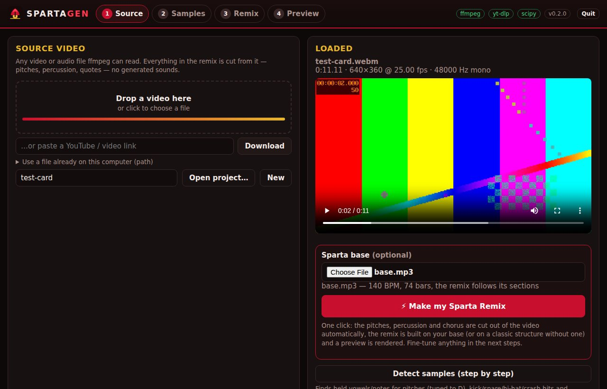
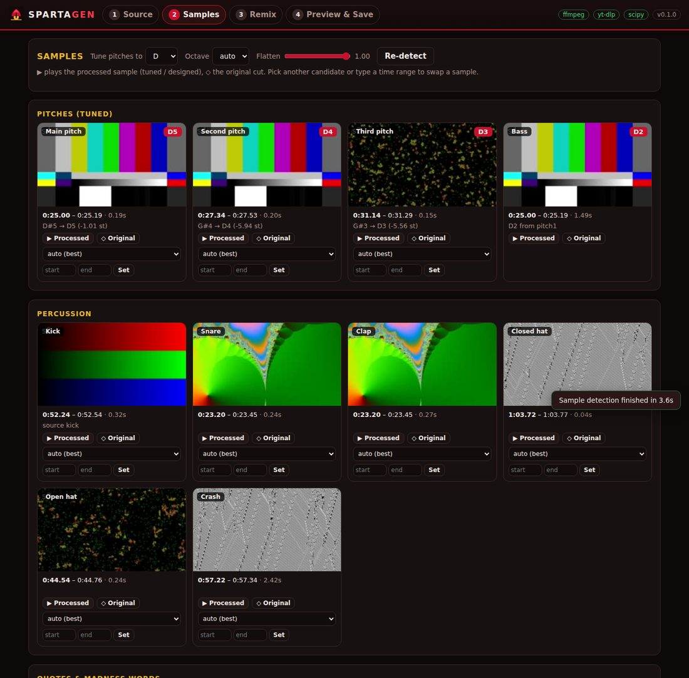
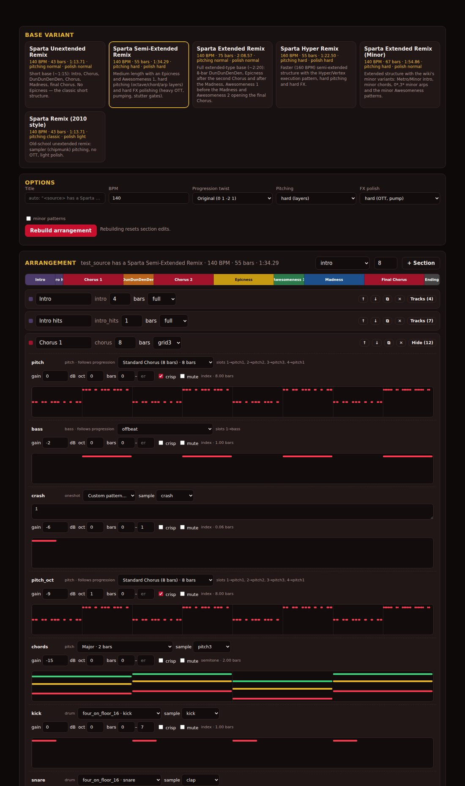
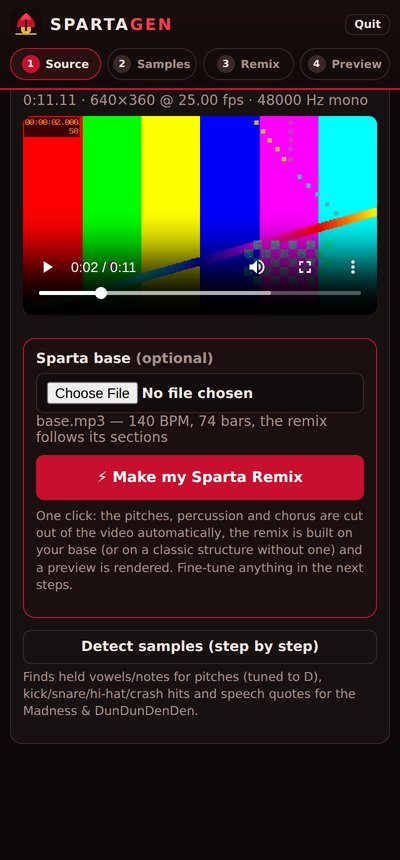

# Sparta Gen — a real Sparta Remix generator

Sparta Gen turns any video into a **Sparta Remix** the way remixers build them by hand — no AI music, no synthesizers:

1. **Cuts the source video into samples** with ffmpeg — held vowels/notes become *pitches*, thumps/bangs/hisses become
   *kick, snare/clap, hi-hats and crash*, and speech becomes *quotes*, *Madness words* and *DunDunDenDen syllables*.
2. **Fixes every pitch sample into a D note** (the key of the classic bases) with TD-PSOLA hard-tuning — the
   "Melodyne pitch drift 100 %" treatment — and derives the **bass pitch** (D3, the main pitch played an octave
   lower like a sampler), **main**, **second**, **third** and **fourth** pitches.
   The **Chorus plays two layers**: the **main phrase** — cut into two parts at the gap between its syllables (on a
   zero crossing) and played as it is on the Chorus pattern, `1` the first part, `2` the second ("the chorus always
   contains the main phrase", Sparta Remix Wiki) — and **several pitches** under it, playing together: the wiki's
   *1\*, 12\*, Chords* lines — root, third and fifth, each line on its own pitch sample, bouncing root/octave in
   8ths on the chords (the fourth pitch doubles the roots an octave down in the Final Chorus). The main phrase **keeps playing through the Epicness
   and the Awesomeness** ("for the tricky epicness pattern, you will need 3 quote/word samples (the two of them you
   used is in your chorus)" — GageDaRemixer's guide on the wiki), with the chords held under it on the second to
   fourth pitch. The DunDunDenDen chops the main phrase.
   Pitch samples cut from songs are **isolated first** (only the held note's harmonics are kept, the band under it
   is pushed down ~30 dB) so they still sound like clean notes once tuned.
3. **Sequences the patterns from the Sparta Remix Wiki** (standard Chorus `11_11_111_1_1_11222_2_222_222_2_…`,
   DunDunDenDen, Madness call & response, the Epicness and its 13 edits, Awesomeness 1/2 and 30 custom ones,
   Execution, chords, percussion and hi-hat patterns, 43 freestyles…) over the classic D → E♭ → C → E♭ progression.
4. **Reads your Sparta base** — tempo, bar 1, key, chord progression and its sections (Intro, Chorus,
   DunDunDenDen, Awesomeness 1, Madness, Epicness, Awesomeness 2, Ending) — and builds the remix on it, bar for bar.
5. **Polishes the mix with an Xleth-style FX rack** (3-band OTT, ChorusCrisp "Jario" pluck, compressor, limiter,
   saturation, reverb, delay, chorus, flanger, phaser, transient shaper, sidechain pump, filter sweeps, tape stop).
6. **Renders the video**: every note shows its own clip, in sync — fullscreen hits, Madness split screen, 3×3/4×4
   grids, flips on every hit, flashes and kick zoom-punch — over the source itself, blurred and dimmed, behind the
   boxes.

Everything happens in one app with a **preview before you save**, on **Windows, macOS, Linux and Android** (an
installable APK with the engine and ffmpeg inside). **One click** does it all: drop your video (and your Sparta base),
press **⚡ Make my Sparta Remix**, and the samples are cut automatically, the remix is built on the base and a preview
is rendered — then fine-tune anything you like.



### Quick start — your next remix, on your own

1. Open Sparta Gen (the Android app, the desktop app, or `spartagen gui`).
2. **Source**: drop the video (on a phone: tap *Drop a video here*, or *Share → Sparta Gen* from the gallery).
3. **Sparta base**: pick your base (mp3/wav) in the box under the video — optional.
4. Press **⚡ Make my Sparta Remix** and watch the preview (samples cut automatically: pitches tuned to D,
   percussion, chorus, quotes; the remix follows your base's sections).
5. Not happy with a sample? *Samples* tab → ▶ to listen, pick another candidate. Want another pattern? *Remix* tab.
6. **Preview** tab → **Render final video** (720p/1080p) → download it; **Export sample pack** gives you every
   cut sample in folders (Chorus, Pitches, Percussion, Quotes) for your own projects.

Command line, same thing: `spartagen make my_video.mp4 --base my_base.mp3 --pack my_pack/`.

---

## Contents

- [Quick start](#quick-start--your-next-remix-on-your-own) · [Install](#install) · [Using the app](#using-the-app) · [Android app](#android-app) · [Desktop apps](#desktop-apps) · [Command line](#command-line)
- [Base variants](#base-variants) · [Pattern notation](#pattern-notation) · [How samples are made](#how-samples-are-made)
- [FX polishing](#fx-polishing) · [Using a real Sparta base](#using-a-real-sparta-base) · [Sample pack export](#sample-pack-export)
- [Development](#development) · [Credits](#credits) · [Known limitations](#known-limitations)

## Install

| Platform | Easiest way |
|---|---|
| **Windows / macOS / Linux** | Download `SpartaGen-<version>-<Windows\|macOS\|Linux>-<arch>.zip` (ffmpeg included), unzip, run **SpartaGen** (`SpartaGen.exe` on Windows, `SpartaGen.app` on macOS — `arm64` for Apple silicon, `x64` for Intel Macs). On Windows and macOS it opens in its own window; on Linux in your browser. First start of an unsigned app: Windows → *More info → Run anyway*; macOS → *System Settings → Privacy & Security → Open Anyway* (or `xattr -dr com.apple.quarantine SpartaGen.app`). |
| **From source (any desktop)** | Install Python 3.9+, then double-click `scripts/run_windows.bat`, `scripts/run_macos.command`, or run `scripts/run_unix.sh`. First start creates a virtual environment and installs everything (ffmpeg comes from `imageio-ffmpeg` if you have none). |
| **Android** | Install the APK (`SpartaGen-<version>-Android.apk`, ffmpeg included), open it on the phone and allow installing from that source. See [Android app](#android-app). *Alternative:* [Termux](https://termux.dev) + `curl -fsSL https://raw.githubusercontent.com/TheQSN/sparta-gen/HEAD/scripts/install-termux.sh \| bash`, then `spartagen gui` (opens in the phone's browser). |
| **pip** | `pip install -e ".[all]"` (needs ffmpeg on PATH or the `imageio-ffmpeg` extra), then `spartagen gui`. |

**Where the apps are**: every app — Windows, macOS, Linux, Android — is built and tested by one workflow. Push a
tag like `v0.2.0` and they all land in **one GitHub release**; or GitHub → *Actions* → *test & build* → *Run
workflow*, then download them from that run's *Artifacts* (`SpartaGen-Windows-X64`, `SpartaGen-macOS-ARM64`,
`SpartaGen-macOS-X64`, `SpartaGen-Linux-X64`, `SpartaGen-Android-APK`). It is the same app everywhere: same engine,
same screens, same one-click remix.

Requirements (from source): **ffmpeg** and **numpy**. `scipy` (faster), `yt-dlp` (links), `pillow` (audio-only cards) are optional —
there is a pure-numpy fallback for every filter, so minimal installs (e.g. Termux without scipy) still work.

## Using the app

`spartagen gui` (or the desktop app) starts a local engine and opens the UI in your browser
(`--window` opens a native window when `pywebview` is installed). It works on phone screens too.

1. **Source** — drop a video, paste a YouTube/other link (downloaded with yt-dlp), or give a local path.
   **One click:** add your Sparta base (optional) and press **⚡ Make my Sparta Remix** — the pitches, percussion,
   chorus and quotes are cut automatically, the remix is built on the base's own sections (a classic structure
   without one) and a preview is rendered; the app jumps to it. Everything below stays editable afterwards.
   **Step by step:** press **Detect samples**.
2. **Samples** — every detected sample is shown with its clip, time range, detected note and the tuning
   (e.g. `D#5 → D5 (-1.01 st)`). ▶ plays the processed sample, ◇ plays the original cut (and its video).
   Swap any sample for another candidate, or type a start/end time. Change the key (default **D**), the pitch
   octave or how hard the pitch is flattened.
3. **Remix** — pick a base variant, BPM, *Progression Twist* (Original `0 1 -2 1`, E Note, F Note, Useful's,
   Elasticity…), pitching and polish level. Every section and track is editable: pick any wiki pattern from the
   library (with a piano-roll preview), type your own in wiki notation, change gain/octave/bars, mute tracks,
   reorder/duplicate/add sections (Intro, Chorus, DunDunDenDen, Epicness, Awesomeness, Madness, Execution…).
   The **Pattern lab** parses anything you paste from the wiki and can add it to the library.
4. **Preview & Save** — **Render preview** makes a fast 640×360 version to watch first; **Render final video**
   renders 720p/1080p. Download the MP4 and WAV, export the **sample pack**, save the project.





<p align="center"></p>

## Android app

The APK is the whole thing on the phone — no Termux, no computer: the same engine (Python, run by
[Chaquopy](https://chaquo.com/chaquopy/)) and the same app, in a full-screen WebView, with ffmpeg built for Android
inside.

- **Install**: download `SpartaGen-<version>-Android.apk` (see [Install](#install)), open it, allow installing apps
  from your browser/file manager when Android asks. Needs Android 7.0+ on a 64-bit ARM phone (nearly every phone
  since 2017).
- **Use**: *Drop a video here* opens the phone's picker (gallery, files, Drive…); or **Share → Sparta Gen** from
  the gallery. Add your base, press **⚡ Make my Sparta Remix**. Tapping a download saves it on the phone: videos in
  **Movies/SpartaGen**, audio in **Music/SpartaGen**, sample packs in **Download/SpartaGen**.
- The engine runs as a foreground service ("Sparta Gen engine" notification) so a render goes on with the screen
  off; *Quit* in the app stops it. Projects live in the app's own storage
  (`Android/data/gen.sparta.remix/files/SpartaGen`).
- A phone is slower than a computer: a 2-minute remix's preview takes a few minutes, the 720p render longer.
- Updates install over the previous version (every build is signed with the same key; see
  [android/README.md](android/README.md) to sign with your own).

How it is built (`android/`, jobs *ffmpeg for Android*, *Android app* and *Android app on an emulator* in
`build.yml`): `android/ffmpeg/build.sh` cross-compiles x264 + ffmpeg with
the Android NDK and packages the program as `libffmpeg.so` (Android only lets an app run programs from its
native-library folder); Gradle + Chaquopy package the repository's `spartagen` package with Python 3.12, numpy and
yt-dlp. The APK is built, and an x86_64 build is run on an Android emulator: the engine starts, its ffmpeg runs and
the one-click remix renders a preview. Tags (`v*`) put the APK in the release with the desktop apps.

## Desktop apps

`scripts/build_desktop.py` makes a one-folder app with PyInstaller — Python, numpy/scipy, the engine, the web app and
a static ffmpeg inside — zipped as `SpartaGen-<version>-<os>-<arch>.zip`. On Windows (Edge WebView2) and macOS
(WebKit) the app opens in **its own window** (pywebview); downloads from the app (renders, sample packs) go to your
Downloads folder, and *Quit* closes the window. On Linux it opens your browser (`SpartaGen --browser` does that
everywhere). CI builds it on Windows, macOS (Apple silicon and Intel) and Linux and runs each built app's
**self-test** before keeping it — `SpartaGen --selftest report.json`: a test video through the one-click remix,
with the bundled ffmpeg (`spartagen selftest` does the same from a source install).

## Command line

```bash
spartagen make  video.mp4 --base my_sparta_base.mp3 --pack pack/   # one command: samples, remix on the base, pack
spartagen make  video.mp4 --variant semi_extended --quality 720p -o remix.mp4
spartagen make  "https://www.youtube.com/watch?v=…" --variant extended --pack pack/   # also export the sample pack
spartagen make  video.mp4 --audio-only -o remix.wav --polish hard --progression "0 1 3 1 | -2"
spartagen make  video.mp4 --base my_sparta_base.mp3     # map the base and build the remix on its sections
spartagen base  my_sparta_base.mp3                      # just show the base map (tempo, bar 1, chords, sections)
spartagen analyze video.mp4              # what would be cut into samples (pitches with their notes, hits, quotes)
spartagen pack    video.mp4 -o pack/     # tuned samples as WAV + their video clips as MP4
spartagen patterns --section chorus      # the pattern library
spartagen patterns --parse "11_11_111_1_1_11222_2_222_222_2_"
spartagen variants
```

Useful options: `--bpm`, `--key D`, `--pitch-octave 4`, `--pitching classic|normal|hard`,
`--polish light|normal|hard`, `--minor`, `--chorus-pattern chorus.0_12`, `--chorus-pitch`, `--intro-pattern intro.nos`,
`--stems`, `--project project.json`.

## Base variants

| Variant | BPM | Length | Structure |
|---|---|---|---|
| **Unextended** | 140 | 43 bars ≈ 1:14 | Intro · intro hits · Chorus · DunDunDenDen · Chorus · Madness · final Chorus · Ending |
| **Semi-Extended** | 140 | 55 bars ≈ 1:34 | + Epicness and Awesomeness 1 — **hard pitching** (octave, chord and arp layers) and **hard FX polishing** (heavy OTT, sidechain pump) |
| **Extended** | 140 | 74 bars ≈ 2:07 | The 2:08 extended base's layout: 3 intro hits · Chorus 4 · DunDunDenDen 6 · Chorus 4 · Epicness 4 · Awesomeness 1 · Chorus 8 · Madness 8 · Chorus 8 · Epicness 12 · Awesomeness 2 · final Chorus 8 · Ending |
| **Follow my base** | the base's | the base's | Appears once a base is loaded: every section of the base gets its part (see [Using a real Sparta base](#using-a-real-sparta-base)) |
| **Hyper** | 160 | 55 bars ≈ 1:23 | Semi-extended with the Hyper/Vertex execution pattern, hard pitching and FX |
| **Minor** | 140 | 67 bars ≈ 1:55 | Extended with the wiki's minor variants (Metro/Minor intro, minor chords, `0*, 3*` arps, minor Awesomeness) |
| **Classic (2010)** | 140 | 43 bars ≈ 1:14 | Unextended with sampler ("chipmunk") pitching, no OTT, light polish |

Sections and what plays in them:

- **Chorus** — the main phrase on the standard 8-bar Chorus pattern (3 lines: main line ×2, swapped line, 32nd-note
  ending; `1` = first part, `2` = second part, as they are — tick *pitched chorus* / `--chorus-pitch` to tune it to
  the chords too) over several pitches playing the *1\*, 12\*, Chords* lines together: the main pitch on the
  roots, the second pitch on the thirds, the third pitch on the fifths (`0* 12*`, `4* 16*`, `7* 19*` …, the minor
  lines on a minor base); in the Final Chorus and with hard pitching the fourth pitch doubles the roots an octave
  down (the pattern's seventh line — a major seventh and a raised eleventh — clashes with a base's major chords, so
  it is left out; pick any other pitch pattern with the pattern list); ChorusCrisp pluck; the bass pitch on the
  offbeats; the wiki's *Normal Percussion* (kick every beat, clap on 2 and 4 with the kick paralleled — once —
  open hats on the off-beats: "open hi-hats are mostly used for in-pattern hi-hats … the closed one mostly used a
  repetitive pattern") over a closed hi-hat layer on every 8th, and the layers Citrus adds in his remix on the
  extended base (measured over 24 chorus bars): a second hi-hat on the "a" of beat 3 (and the "and" of beat 4 every
  other bar) and an extra hit on the "and"s of beats 3 and 4; a crash whose clip flashes fullscreen for an 8th on
  the downbeat. The main phrase big in the middle, a box per pitch (and the bass) along the top, drums along the
  bottom. On a base there are no fills of our own: the base has its fills, and the example remix on the same base
  keeps the plain pattern through every section. (A Chorus in the base's DunDunDenDen part instead, as one example
  remix does: `dundundenden_part="chorus"`.)
- **DunDunDenDen** (the Buildup) — the wiki's Original Pattern `1___2___3A___3B___`: loud quarter notes with
  silence in between, stepping through the **main phrase** as it is — `1`, `2` its parts, `3A`/`3B` the third word's
  halves — with a pitch sample on every hit on the chord root (`0 0 1 1 -2 -2 1 1`, one pitch per step). It builds
  like the base under it: the percussion joins a third of the way in, the held chords and the bass pitch two thirds
  in (on the 2:08 extended base: 0:10, 0:13, 0:17). The Chorus's frame, black between hits.
- **Madness** — the call & response (the Madness article's *Original Pattern*: `1` = first person's word, `2` = the
  second person answering, both together in the last bar) over the softer, low-passed Madness pitch patterns: the
  *First Pattern* from the first half to the end, the *Trance Gate* pattern joining from the second half.
  Split screen.
- **Epicness** — after the Chorus that follows the DunDunDenDen and after the Chorus that follows the Madness.
  The Epicness pattern played by the Chorus's samples — `1` and `2` the main phrase's two parts, `3` a third word
  of the same voice — so the chorus never drops out; the pitches double the pattern on the chords and the second
  to fourth pitch hold the chords under it. By default it is the tutorial's version, on the downbeat, in every
  4-bar block: `1_1_332_1_1_11__1_1_113_3_22221_3_1_332_1_1_111_1111111111111111` with the second line's 3s
  (`3_3__________3__3_3333_33`) before and over the closing roll. The wiki's ORIGINAL (its `1*` as a lead-in two
  16ths before the section) and all 14 edits (CatmanTeam, TheInfySpartan, majugarzett…) are in the library, and an
  edit can alternate with it. The Chorus's frame (the main phrase big in the middle, a box per pitch along the top);
  no text over it (the spinning *OMG TEH EPICNESS* is an option: `"titles": true` in the project's video settings).
- **Chords (Pre-Awesomeness)** — held chords and `0*, 12*` bounces (a section you can add before an Awesomeness).
- **Awesomeness 1 / 2** — the pattern on the main pitch, an octave below on the second, the chords on the second
  to fourth pitch, and the main phrase following its rhythm (part 1 in the first half of each bar, part 2 in the
  second), in the Chorus's frame.
- **Ending** — one hit on the base's last chord (every pitch on its chord tone, bass, kick, clap, crash — once),
  then a quote from the source played as it is, fullscreen, while the chord rings out (a tape stop without a
  base). **Execution**, **Intro** (quotes, then the 3-hit intro pattern).

## Pattern notation

Patterns use the Sparta Remix Wiki notation (*Pitch Patterns* page):

| Symbol | Meaning | Symbol | Meaning |
|---|---|---|---|
| `***` | 4th note | `0` (bare number) | 16th note |
| `**` | "6th" note (3 sixteenths) | `'` | 32nd note |
| `*` | 8th note | `"` | 64th note |
| `+#` / `-#` | # semitones up / down | `_` | 16th rest |
| `#` | root key/note (`0`) | `/` · `\` | 32nd · 64th rest |
| `\|` | semi-progression (split) | `*****` · `******` | dotted quarter · half note |

Three styles are recognised automatically (you can also force one):

- **semitone** — `0* 12* 0* 12* 1* 13* …`: numbers are semitones from the base's root (0 = D).
- **compact** — `00_00_0011_11_11-2-2_…` (Madness *First Pattern*): each digit is its own note.
- **index** — `11_11_111_1_1_11222_2_…` (standard Chorus, Madness): digits are **slots** — 1 = main pitch / first
  speaker, 2 = second pitch / second speaker… — and each hit plays the root of the current chord.

Picking a **Progression Twist** re-targets every semitone pattern written for `0 1 -2 1` (e.g. under `0 1 2 1` a
note on C moves to E). Multi-line patterns (Chords) play their lines together — in the remix templates each line on
its own pitch sample (root on the main pitch, third on the second, fifth on the third, seventh on the fourth), so
several pitches are heard, and seen, at once.

Index patterns may use `B` (slots 1 and 2 together, from the Madness freestyles).
Percussion patterns are index patterns too: `1` kick, `2` clap/snare (with the kick paralleled, as the Percussion
article describes), `3` hi-hat.

The library holds **210 patterns** from the wiki (7 progressions, 6 intros, 27 chorus patterns, 13 chord sets,
14 DunDunDenDens, 15 Execution patterns, 34 Awesomeness (originals + customs), 9 Madness pitch patterns and 6 call &
response patterns, 14 Epicness patterns, 17 percussion and 5 hi-hat patterns, 43 freestyles).
Where a wiki transcription did not add up to whole bars, the obvious typo is fixed and documented in the source
(`spartagen/patterns/library.py`, field `fix`).

## How samples are made

- **Detection** (`spartagen/audio/analysis.py`): frame features at ~11.6 ms (energy, band energies, band-limited
  spectral flatness, spectral flux, MFCCs) plus a vectorised YIN pitch tracker.
  - *Pitch* candidates are steady voiced windows (local pitch spread < 35 cents), ranked by length, stability,
    clarity, loudness and "vowel-ness". Pitch 2 and 3 come from other moments of the source (another word or
    speaker) so the Chorus call & response is audible.
  - *Kick* = sharp onsets with low-frequency body; *snare/clap* = sharp, noisy, broadband "bangs";
    *hats* = sibilants ("s", "ts") and cymbal hiss; *crash* = longer loud noisy stretches.
  - *Quotes* are phrases between pauses; *words* are split at energy valleys; the best quote is the
    **main phrase**, chopped into syllables for the DunDunDenDen.
  - The **main phrase** (the Chorus clip) is the best clear word or short phrase of the voice — held notes beat
    glides, which keeps a sliding instrument from winning over the singer — cut in two at the deepest energy valley
    between 35 % and 65 % of it (else at the biggest change of sound, else the middle), snapped to a zero crossing.
    The parts keep their own sound; a tuned copy is only used with *pitched chorus*. The Epicness's third sample is
    the next best word of the voice, whole, from another moment of the source. The DunDunDenDen syllables and
    the ending use the same phrase; the Madness words come from the same voice ranking.
- **Isolation** (`spartagen/audio/harmonic.py`): a held note cut from a song carries the band under it. A
  time-varying harmonic mask on the short-time spectrum keeps the bins around every harmonic of the tracked note
  (the detected pitch stands in where the band hides it from the tracker) and pushes everything between them
  ~30 dB down — the source's own audio, filtered, like Melodyne's note separation. Pitch candidates are ranked by
  how clearly they read as a note once isolated and tuned — voiced, harmonic, and sitting on the note (a singer
  bending into a note from its neighbour keeps some of the bend through the tuning), and keeping its level an
  octave up (a voice with hardly any overtones loses its high notes) — and longer held notes win.
- **Whole held notes**: pitch candidates come from the full mix, where the band hides the voice now and then; each is
  grown to the whole note on the isolated voice (same note within 60 cents, up to 0.9 s), so it needs less
  stretching to fill an 8th or a held chord.
- **A pitch is the held note**, not the sung word: each pitch is cut to its steady core (voiced, loud, on one
  pitch), dropping the consonant before it and the glide after it — the clip with it.
- **Pitches that sound different**: after the main pitch, each pitch is picked for quality *and* for how far its
  sound (mean MFCCs once tuned — vowel, voice, instrument) is from the pitches already chosen, so the several
  pitches are not the same note four times. They all share the main pitch's octave (they play chord lines
  together), and a note that still loses its level when shifted far up is played the sampler way.
- **One shot per pitch** (music videos): a note the video cuts away from is shortened at the camera cut (colour
  histogram / picture jump), audio with the picture, so each pitch's box shows one shot; an automatic pick has to
  keep at least 0.18 s of its note inside one shot (an 8th at 140 BPM is 0.21 s), else it is passed over.
- **Automatic picks, no help needed**: every pitch candidate is grown, isolated, tuned and measured; a pick is
  rated by how the note comes out (its steady core's length, not the clip around it), how clearly it reads as a
  note, and how little it has to move to reach the key; the pitches come from other clips than the Chorus's (heard
  and seen in every Chorus already) and from other moments than each other; and the second to fourth pitch are
  dealt out by how well they take an octave up — the Chorus lifts the third pitch highest (+19), the second next
  (+16), the fourth plays the low root. On the source of the example remix, the automatic picks are three of the
  four pitches chosen by ear, and every note of the remix sits within ±35 cents of its target. Tuned candidates are
  kept per source, so swapping a pick in the *Samples* tab rebuilds in a moment.
- **Tuning to D** (`spartagen/audio/psola.py`): pitch marks every period, TD-PSOLA re-synthesis with every period at
  the target note (formants kept). Transpositions reuse the synthesis marks; long notes are sustained by PSOLA
  stretching or ping-pong looping of the steady part.
- **Designed hits** (`spartagen/samples.py`): kick = the source's thump, at most an octave down so it keeps its
  knock (body ~90–150 Hz), + pitch-sweep punch + the original click; snare/clap = EQ'd bang with transient boost
  (clap = three retriggers); hats = high-passed hiss with short/long decays; crash = noise + long reverb tail;
  bass = the lowest tuned pitch played an octave lower (D3, like a sampler), lightly filtered and saturated.

Every sample keeps its source time range, so its **video clip is known** — that is what the renderer shows.

## FX polishing

Modelled on the effects [Xleth](https://github.com/composition-cassidy/Xleth) ships for Sparta/YTPMV work
(independent numpy implementations, no Xleth code is included):
**OTT** (3-band Linkwitz-Riley split, upward + downward compression with the classic OTT band table; depth scales
compression, not a dry/wet mix), compressor, look-ahead limiter, EQ/filters, waveshaper (tanh/soft/hard/fold/asym),
transient processor, bitcrusher, algorithmic reverb, ping-pong delay, chorus, flanger, phaser, stereo width,
kick-driven sidechain pump, trance gate, filter sweeps, tape stop, stutter and pitch sweeps — plus the
**ChorusCrisp** "Jario Style" pluck on chorus notes (split at 40 ms, 80 % overlap, −3 dB duck).
Masters land around −12 / −10 / −8.5 LUFS for light / normal / hard polish with a −1 dBFS ceiling.


## Using a real Sparta base

Remixes normally sit on a Sparta base. Add one in the *Remix* tab (or `--base`) and it is mapped
(`spartagen/audio/base.py`):

- **tempo and bar 1** from the base's own drums on a 16th grid (e.g. `140 BPM, bar 1 at 0.139 s`);
- **key and progression** from the chords of every half bar (triads above the bass — a base's kick is often tuned
  and would fool a bass reading), e.g. `key D, progression 0 1 -2 1`, and whether the key chord is **minor** (the
  pitch chords follow it: major or minor thirds);
- **the Epicness by its roll**: the Epicness ends on a roll of 16ths, and a base's own Epicness carries it — a 4-bar
  block ending on a roll is the Epicness (on the extended base, bars 21-24 at 0:34, after an 8-bar Chorus);
- **sections**: the Chorus is the loud texture that keeps coming back; the Madness is the soft breakdown; the
  rest follow from their places as the wiki describes the structure — the DunDunDenDen after the first Chorus, an
  Epicness after the Chorus that follows it and after the Chorus that follows the Madness, Awesomeness 1 as the
  last pattern before the Madness, Awesomeness 2 opening the final Chorus;
- the **intro hits** (where and on which note) and the **last chord**.

`spartagen base my_base.mp3` prints the map, e.g. for the 2:08 extended base:

```
140 BPM, bar 1 at 0.139s, 74 bars, key D, progression 0 1 -2 1
  bars   1-  2  intro          bars  25- 32  chorus
  bars   3-  6  chorus         bars  33- 40  madness
  bars   7- 12  dundundenden   bars  41- 48  chorus
  bars  13- 16  chorus         bars  49- 60  epicness
  bars  17- 20  epicness       bars  61- 64  awesomeness2
  bars  21- 24  awesomeness1   bars  65- 72  chorus
  intro hits: step 0 (-2), step 8 (-2), step 16 (-2)      ending on +1   (bars 73-74)
```

The **Follow my base** structure then gives every base section its part, lined up with bar 1. Mix modes:
*remix* (default) keeps the source-made percussion (the wiki's percussion patterns) and the source bass on top of
the base and leaves the held pad chords to it; *replace* also mutes the source percussion and bass; *layer* keeps
everything. The video only shows
what is heard. Labels are a best guess from the signal — every section stays editable in the arrangement.

## Sample pack export

*Export sample pack* (or `spartagen pack` / `spartagen make … --pack pack/`) writes every sample as a WAV (pitches
already tuned to D) **and** its video clip as an MP4 with the processed audio, in the folders remixers keep, plus
`samples.json` — ready for Vegas, FL Studio or Xleth if you prefer to finish by hand:

```
1 Chorus/            Chorus 1 (first part), Chorus 2 (second part), Epicness 3 (third word),
                     DunDunDenDen 3A / 3B, Main phrase, Syllables (chops)/
2 Pitches/           Pitch 1 (main) - D4, Pitch 2 - D4, Pitch 3 - D4, Pitch 4 - D4, Bass pitch - D3
3 Percussion/        Kick, Snare, Clap, Hi-hat closed, Hi-hat open, Hi-hat 2, Extra hit, Crash
4 Quotes and words/  Quote 1-3, Madness word 1 / 2
```

## Development

```bash
pip install -e ".[dev]"
pytest                 # 212 tests: notation, DSP, pitch accuracy, base mapping, full pipeline, HTTP API, app engine
python scripts/build_desktop.py --test   # PyInstaller app with ffmpeg bundled + its self-test (what CI does per OS)
spartagen selftest                       # this install: a test video through the one-click remix
# Android: see android/README.md (NDK for ffmpeg, then ./gradlew assembleRelease in android/)
```

Layout: `spartagen/ffmpeg.py` (media I/O) · `audio/` (dsp, pitch, psola, harmonic, analysis, base, fx) · `samples.py` ·
`patterns/` (notation parser, wiki library) · `arrangement.py` (variants, sections, note compiler) ·
`render_audio.py` · `render_video.py` · `project.py` (pipeline) · `cli.py` · `gui/` (server + static UI).
`spartagen/android.py` (the engine inside the APK) · `android/` (the Android app, ffmpeg build script, emulator test) ·
`spartagen/selftest.py` + `packaging/` + `scripts/build_desktop.py` (the desktop apps).
CI (`.github/workflows/build.yml`) runs the tests with and without scipy on every push; the apps (desktop and
Android, each tested) are built for tags (`v*` — one release with all of them), on manual dispatch, and for pushes
that change them.

## Credits

- Pattern data: [Sparta Remix Wiki](https://spartaremix.fandom.com/wiki/Pitch_Patterns) contributors
  (CC BY-SA) — remixer and base names are kept with each pattern.
- Design references: [Xleth](https://github.com/composition-cassidy/Xleth) (FX set, OTT behaviour, declick,
  PSOLA/loop ideas), [ChorusCrisp](https://github.com/composition-cassidy/ChorusCrisp) (the Jario pluck),
  [Sparta Remix Visual Editor](https://github.com/composition-cassidy/Sparta-Remix-Visual-Editor) (grid/flip
  conventions) by composition-cassidy.
- YIN: de Cheveigné & Kawahara (2002). BS.1770-4 loudness. TD-PSOLA: Moulines & Charpentier (1990).

## Known limitations

- Detection is signal-based: on busy sources (music under dialogue) an automatic pick can still miss what your ear
  would choose — swap it for another candidate or type a time range in the *Samples* tab.
- Base section labels are heuristics tuned on the classic D bases; unusual bases may need a section renamed in the
  arrangement. Where the wiki places the *Execution* section varies by base — it is available as a section to add
  (the Hyper variant uses it).
- Some Chromium builds without proprietary codecs cannot play H.264 in the page; the app then offers the preview
  as a download (normal Chrome, Edge, Firefox, Safari and Android browsers play it).
- The Android app is 64-bit ARM only (the build script also makes x86_64 and 32-bit ARM ffmpeg if you build it
  yourself) and is installed from the APK, not a store. Phone renders are slower than a computer's.
